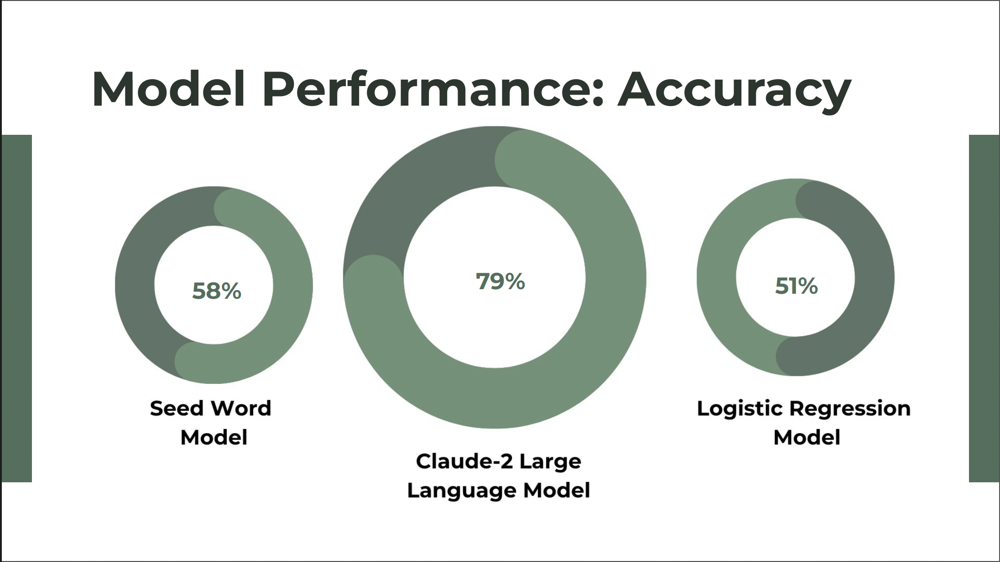

## Model Performance

### Comparative Analysis

#### Performance Metrics
- Claude-2 Large Language Model: 79% accuracy
- Seed Word Model: 58% accuracy
- Logistic Regression Model: 51% accuracy

## Key Findings

### Technical Achievements
- Successfully developed multi-model classification system
- Demonstrated LLM superiority in safety trait classification
- Created effective seed word methodology
- Established robust baseline metrics

### Unexpected Discoveries
- Significant performance gap between traditional and LLM approaches
- High effectiveness of curated seed words despite limited training data
- Clear pattern in trait distributions across reports

## Impact Assessment

### Safety Implications
- Enhanced maintenance of nuclear safety standards
- Automated processing of extensive safety reports
- Support for California's nuclear energy infrastructure
- Contribution to accident prevention measures

### Operational Benefits
- Streamlined safety report analysis
- Improved trait classification efficiency
- Enhanced understanding of safety patterns
- Better resource allocation for safety measures

## Future Directions

### Current Limitations
- Dataset availability constraints (13/33 reports)
- Room for model performance improvement
- Primary classification focus only

### Development Roadmap
1. Exploration of additional LLM architectures
2. Implementation of multi-class classification
3. Dashboard development with model integration
4. Automated issue extraction system development

### Data Expansion Plans
- Increasing report coverage
- Enhancing trait representation
- Developing comprehensive annotation guidelines
